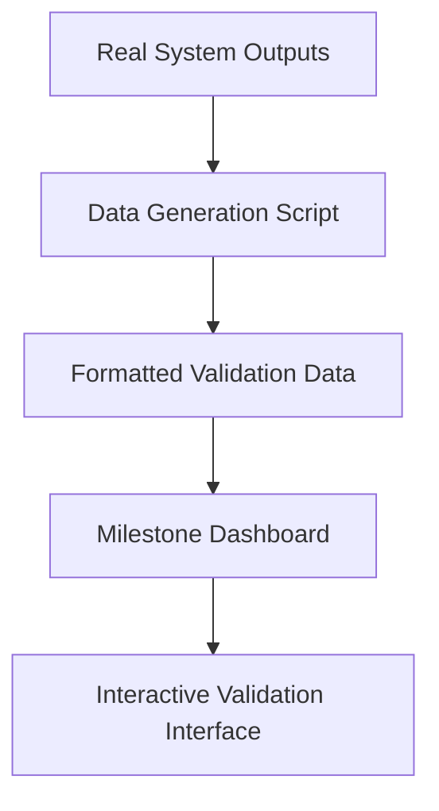

# 🏗️ TSHill Content Automation Engine MVP
## System Architecture Documentation

**Document Version:** 2.0  
**Author:** opencode (AI Assistant)  
**Date:** December 9, 2025  
**Purpose:** Comprehensive system architecture reference for development and review  
**Compliance:** Following AI Safety Development Protocols (AI_SAFETY_DEVELOPMENT_PROTOCOLS.md)  
**Updates:** Added Data Generation Pipeline Architecture, File Organization Standards, Integration Dashboard Architecture, Browser-Compatible Path Standards

---

## 🎯 Architecture Overview

### **System Purpose**
The TSHill Content Automation Engine MVP is a **deterministic content generation system** that converts structured YAML briefs into branded visual posts (images + captions + metadata) using a layer-based template architecture.

### **Core Architectural Principles**

#### **Design Principles**
1. **Single Responsibility Principle:** Each module has one clear, well-defined purpose
2. **Open/Closed Principle:** Modules open for extension, closed for modification
3. **Liskov Substitution:** Components can be substituted without breaking functionality
4. **Interface Segregation:** Clients depend only on interfaces they actually use
5. **Dependency Inversion:** High-level modules don't depend on low-level modules

#### **Layer-Based Architecture**
- **Template Layer:** Defines visual layout, styling, and content slots
- **Business Logic Layer:** Handles content processing and transformation
- **Rendering Layer:** Converts structured data into visual outputs
- **Output Layer:** Manages file organization and metadata

#### **Separation of Concerns**
- **Content vs. Presentation:** Brief data separate from visual rendering
- **Configuration vs. Logic:** Template definitions separate from processing logic
- **Generation vs. Output:** Content creation separate from file management

---

## 🧱 Core System Components

### **1. Template System**
**Location:** `/templates/`  
**Purpose:** Defines reusable visual layouts and content slots

#### **Components**
- **Template Files:** YAML files defining layer structure and styling
- **Palette Definitions:** Color schemes and branding configurations
- **Slot Definitions:** Content placeholders (title, bullets, etc.)

#### **Key Template: `dispatch_tip.yaml`**
```yaml
layers:
  - kind: photo_bg
  - kind: panel_overlay
  - kind: text_block (role: title)
  - kind: list_block (role: tips)
  - kind: watermark
```

### **2. Brief Input System**
**Location:** `/data/briefs/`  
**Purpose:** Structured content requests defining output requirements

#### **Brief Structure**
```yaml
id: unique_identifier
title: "Post Title"
bullets:
  - "Bullet point content"
output_kind: image
aspect_ratio: 1080x1080
palette: palette.core_blue_silver_orange
```

### **3. Rendering Engine**
**Location:** `src/renderer.py`  
**Purpose:** Converts template + brief data into visual assets

#### **Core Classes**
- **`Renderer`**: Main interface for visual generation
- **Rendering Methods**: `_draw_title()`, `_draw_bullets()`, `_add_watermark()`
- **Positioning Logic**: Coordinate calculation and text layout
- **Output Generation**: `_save_output()`

#### **Rendering Pipeline**
1. Load template configuration
2. Parse brief data
3. Filter layers by content availability
4. Render each layer in sequence
5. Composite final image
6. Save with metadata

### **4. Caption Generation System**
**Location:** `src/caption_builder.py`  
**Purpose:** Generates contextual captions and hashtags

#### **Core Classes**
- **`CaptionBuilder`**: Main caption generation interface
- **Format Methods**: `build_caption()`, `_format_hashtags()`
- **Template Integration**: Loads caption formats from template definitions

### **5. Output Management System**
**Location:** `src/output_manager.py`  
**Purpose:** Handles file organization and metadata

#### **Core Classes**
- **`OutputManager`**: Centralized file and metadata handler
- **Directory Structure**: Creates standardized output folders
- **Metadata Management**: Saves render specifications and job data
- **Validation Support**: Handles positioning metadata for validation

### **6. Pipeline Orchestration**
**Location:** `src/main.py`  
**Purpose:** Coordinates end-to-end content generation

#### **Core Classes**
- **`Engine`**: Main pipeline controller
- **Orchestration Methods**: `run_job()`, `_load_brief()`, `_compose_spec()`
- **CLI Interface**: Command-line execution support

---

## 🔄 Data Flow Architecture

### **Primary Data Flow**
```mermaid
graph TD
    A[YAML Brief] --> B[Engine.run_job()]
    B --> C[Template Loader]
    B --> D[Brief Parser]
    C --> E[Renderer]
    D --> E
    E --> F[OutputManager]
    E --> G[CaptionBuilder]
    F --> H[final/post.png]
    G --> I[final/caption.txt]
    F --> J[meta/render_spec.json]
```

### **Component Interactions**

#### **Template → Renderer**
- **Input**: Template path and palette definitions
- **Output**: Layer configuration and styling rules
- **Interface**: YAML parsing and layer filtering

#### **Brief → Renderer**
- **Input**: Brief file path
- **Output**: Structured content data
- **Interface**: YAML validation and content extraction

#### **Renderer → OutputManager**
- **Input**: Pillow image object and metadata
- **Output**: Saved files and directory structure
- **Interface**: File saving and folder creation

#### **Brief → CaptionBuilder**
- **Input**: Brief data and template ID
- **Output**: Formatted caption string
- **Interface**: Content formatting and hashtag generation

---

## 🏛️ System Boundaries & Interfaces

### **External Interfaces**
#### **Input Interface**
- **Format**: YAML brief files
- **Validation**: Schema validation for required fields
- **Error Handling**: Missing fields, invalid formats

#### **Output Interface**
- **Standard Structure**: `outputs/{job_id}/final/`
- **File Types**: PNG image, TXT caption, JSON metadata
- **Naming Convention**: Consistent, timestamped job IDs

### **Internal Interfaces**

#### **Template → Renderer Interface**
```python
class Renderer:
    def __init__(template_path: str, palette_path: Optional[str])
    def render(self, brief: dict) -> Image
```

#### **Brief → Engine Interface**
```python
class Engine:
    def run_job(self, brief_path: str) -> dict
    def _load_brief(self, path: str) -> dict
    def _compose_spec(self, template: dict, brief: dict) -> dict
```

#### **Output Manager Interface**
```python
class OutputManager:
    def create_job_folder(self, job_id: str) -> str
    def save_image(self, image: Image, path: str) -> str
    def save_caption(self, caption: str, path: str) -> str
    def write_meta(self, spec: dict) -> str
```

---

## ⚠️ Architectural Constraints & Limitations

### **Technical Constraints**
- **Static Templates**: No dynamic template generation
- **Pillow Dependency**: Image rendering limited to Pillow capabilities
- **YAML Configuration**: Briefs must be valid YAML
- **File System**: Local file system only (no cloud storage)

### **Performance Constraints**
- **Memory Usage**: Large images may cause memory issues
- **Processing Time**: Complex layouts increase render time
- **File I/O**: Synchronous file operations only
- **Concurrency**: No parallel processing support

### **Security Boundaries**
- **File Access**: Limited to specified directories only
- **No Network Access**: No external API calls
- **No Code Execution**: Briefs cannot contain executable code
- **Input Validation**: All user inputs must be validated

---

## 🔍 Architecture Violation Detection Framework

### **Design Principle Violations**

#### **Single Responsibility Violations**
- **Symptom**: Components handling multiple unrelated concerns
- **Detection**: Methods with mixed purposes (e.g., rendering + file management)
- **Impact**: Reduced maintainability, testing complexity

#### **Dependency Inversion**
- **Symptom**: High-level modules importing low-level implementation details
- **Detection**: Main classes importing specific utility functions
- **Impact**: Tight coupling, difficult to test

#### **Interface Segregation**
- **Symptom**: Large interfaces forcing unused implementations
- **Detection**: Classes implementing methods they don't use
- **Impact**: Unnecessary complexity, violation of interface contract

#### **Open/Closed Violations**
- **Symptom**: Modifying core class behavior instead of extending
- **Detection**: Direct modifications to base classes
- **Impact**: Breaking existing functionality, reduced extensibility

### **Structural Violations**

#### **Circular Dependencies**
- **Symptom**: Module A imports B, B imports A
- **Detection**: Import cycles in dependency graph
- **Impact**: Initialization failures, memory leaks

#### **Tight Coupling**
- **Symptom**: Components requiring specific implementation knowledge
- **Detection**: Hard-coded class names, specific method calls
- **Impact**: Reduced flexibility, difficult to modify

#### **Breaking Abstractions**
- **Symptom**: Implementation details leaking across layer boundaries
- **Detection**: Rendering logic in brief processing, file management in rendering
- **Impact**: Architectural boundary violations, maintenance complexity

#### **Layered Architecture Violations**
- **Symptom**: Components bypassing established layers
- **Detection**: Direct file access without output manager, rendering without templates
- **Impact**: Inconsistent behavior, security risks

### **Regression Indicators**

#### **Functionality Loss**
- **Symptom**: Previously working features no longer function
- **Detection**: Test failures in previously passing scenarios
- **Impact**: Reduced system capability

#### **Performance Degradation**
- **Symptom**: System performance worse than previous baseline
- **Detection**: Increased processing time, memory usage
- **Impact**: User experience degradation

#### **Integration Breakage**
- **Symptom**: Components that previously worked together now failing
- **Detection**: Interface mismatches, data format changes
- **Impact**: System fragmentation, reliability issues

#### **Configuration Drift**
- **Symptom**: System configuration diverging from standards
- **Detection**: Inconsistent output formats, changed file structures
- **Impact**: Compatibility issues, maintenance complexity

---

## 🚀 Extension Architecture

### **Plugin Points**
- **Template Extensions**: New template files in `/templates/`
- **Renderer Extensions**: New rendering backends (Diffusers, custom)
- **Output Extensions**: New output formats (video, social media posts)
- **Validation Extensions**: New validation rules and metrics

### **Future Module Integration**
- **AI Image Generation**: Extend `Renderer.render()` with AI models
- **Cloud Storage**: Extend `OutputManager` with remote storage
- **Batch Processing**: Extend `Engine.run_job()` with job queuing
- **API Integration**: Extend brief processing with external data sources

---

## 📊 System Metrics & Monitoring

### **Key Performance Indicators**
- **Render Time**: Time to generate single post
- **Memory Usage**: Peak memory during rendering
- **File Size**: Output image dimensions and file size
- **Success Rate**: Percentage of successful renders

### **Quality Metrics**
- **Positioning Accuracy**: Deviation from target coordinates
- **Text Rendering**: Font rendering quality and consistency
- **Color Accuracy**: Adherence to specified palette
- **Template Compliance**: Correct layer rendering order

---

## 🛡️ Security Architecture

### **Input Validation**
- **YAML Schema**: Brief structure validation
- **File Path Security**: Path traversal prevention
- **Content Sanitization**: Text content validation
- **Size Limits**: Maximum file and content sizes

### **Output Security**
- **Directory Isolation**: Sandboxed output directories
- **File Permissions**: Controlled access to generated files
- **Metadata Sanitization**: Safe JSON generation
- **Path Validation**: Secure file path handling

---

## 📋 Architecture Compliance Checklist

### **Design Principle Compliance**
- [ ] **Single Responsibility**: Each module has one clear purpose
- [ ] **Open/Closed**: Modules open for extension, closed for modification
- [ ] **Liskov Substitution**: Components can be substituted safely
- [ ] **Interface Segregation**: Minimal, focused interfaces
- [ ] **Dependency Inversion**: High-level modules independent of low-level details

### **Structural Compliance**
- [ ] **No Circular Dependencies**: Clean dependency graph
- [ ] **Loose Coupling**: Components communicate through interfaces
- [ ] **Strong Cohesion**: Related functionality grouped together
- [ ] **Layer Integrity**: Clear architectural layer separation
- [ ] **Abstraction Boundaries**: Implementation details properly encapsulated

### **Integration Compliance**
- [ ] **Interface Contracts**: All interfaces well-defined and consistent
- [ ] **Data Flow**: Clean, predictable data transformation pipeline
- [ ] **Error Handling**: Comprehensive error propagation and handling
- [ ] **Configuration Management**: Centralized, consistent configuration

### **Quality Assurance**
- [ ] **Testing Strategy**: Comprehensive test coverage for all components
- [ ] **Validation Framework**: Automated architecture compliance checking
- [ ] **Performance Monitoring**: System performance tracking and alerting
- [ ] **Documentation**: Complete, up-to-date architecture documentation

---

## 🧪 UNIVERSAL MILESTONE VALIDATION ARCHITECTURE

### **Validation System Overview**
The Universal Milestone Validation Architecture provides comprehensive validation for ALL milestones through a consistent 4-phase pattern: Abstract Framework → Milestone-Specific Implementation → Dashboard → Test Data. This ensures rendering accuracy and prevents regressions through automated validation pipelines that apply the same structural pattern to every milestone.

### **Universal 4-Phase Milestone Pattern**

#### **Phase 1: Abstract Validation Framework** (Applies to ALL milestones)
**Location:** `tests/validation/framework/`  
**Purpose:** Milestone-agnostic base classes and common functionality

**Core Components:**
```python
tests/validation/framework/
├── base_dashboard.py          # Abstract dashboard functionality
├── base_metadata_extractor.py # Abstract metadata extraction
├── base_overlay_generator.py  # Abstract visual overlay creation
└── base_test_runner.py        # Abstract test execution
```

**Abstract Framework Features:**
- **Universal Dashboard Interface:** Common HTML structure and JavaScript functionality
- **Standardized Metadata Format:** Consistent JSON schema across all milestones
- **Reusable Overlay Generation:** Base visual overlay creation and management
- **Common Test Execution:** Standardized test running and result collection

#### **Phase 2: Milestone-Specific Implementation** (Pattern repeats for each milestone)
**Location:** `tests/validation/milestone[X]/`  
**Purpose:** Milestone-specific validation implementations inheriting from abstract framework

**Implementation Pattern:**
```python
tests/validation/milestone[X]/
├── [milestone]_metadata_extractor.py  # Extract [milestone] positioning data
├── [milestone]_overlay_generator.py    # Create visual overlays
├── [milestone]_test_runner.py          # Execute [milestone] validation tests
├── [milestone]_dashboard.html          # Interactive validation interface
└── [milestone]_validation_data.js     # Formatted validation data
```

**Integration Dashboard Special Case:**
```python
tests/validation/integration/
├── integration_dashboard.html           # Multi-mode validation interface
└── integration_validation_data.js       # Array-format validation data
```

**Milestone-Specific Features:**
- **Inherited Base Classes:** Extend abstract framework with milestone-specific logic
- **Custom Validation Logic:** Milestone-specific positioning and rendering validation
- **Specialized Test Data:** Milestone-specific test scenarios and requirements
- **Tailored Interface:** Dashboard customized for milestone validation needs

#### **Phase 3: Universal Dashboard Features** (Same features, different content)
**Purpose:** Interactive validation interface with consistent functionality across all milestones

**Universal Dashboard Components:**
1. **[Milestone] Position Analysis**
   - X/Y coordinate accuracy validation
   - Alignment verification and consistency checks
   - Position-specific validation criteria

2. **Text Rendering Validation**
   - Font loading and rendering verification
   - Text wrapping accuracy checks
   - Milestone-specific formatting validation

3. **Interactive Controls**
   - Test scenario selection (milestone-specific test cases)
   - Tolerance adjustment for positioning (±5px default)
   - Visual overlay toggle (base image vs overlay)
   - Side-by-side comparison views

4. **Validation Metrics**
   - Positioning accuracy scores per element
   - Consistency metrics specific to milestone
   - Overall rendering quality scores
   - Milestone-specific validation criteria

#### **Phase 4: Universal Test Data Categories** (Same categories, milestone-specific content)
**Purpose:** Comprehensive test coverage using consistent test categories across all milestones

**Universal Test Categories:**
1. **Basic Positioning Tests**
   - Standard positions and configurations
   - Different sizes and scaling factors
   - Various starting positions and coordinates
   - Milestone-specific positioning requirements

2. **Line/Spacing Validation**
   - Consistency checks across elements
   - Scaling validation for different sizes
   - Multi-element alignment verification
   - Milestone-specific spacing rules

3. **Text Wrapping Tests**
   - Long content that wraps to multiple lines
   - Various text lengths and wrapping scenarios
   - Boundary condition testing
   - Milestone-specific wrapping behavior

4. **Edge Cases**
   - Single element scenarios
   - Many element scenarios (10+ items)
   - Special characters and formatting
   - Empty content and error conditions
   - Milestone-specific edge cases

5. **Integration Tests**
   - Elements with other milestone components
   - Multi-layer interaction testing
   - Full pipeline rendering validation
   - Cross-milestone integration scenarios

### **Universal Validation Data Flow Architecture**
```mermaid
graph TD
    A[Abstract Framework] --> B[Milestone-Specific Implementation]
    B --> C[Test Case Generator]
    C --> D[YAML Brief Files]
    D --> E[Engine.run_job()]
    E --> F[Renderer with Metadata Extraction]
    F --> G[Output Images + Metadata JSON]
    G --> H[Milestone-Specific Metadata Extractor]
    H --> I[Validation Database]
    I --> J[Milestone-Specific Dashboard]
    J --> K[Interactive Validation Interface]
```

### **Milestone Implementation Examples**

#### **Milestone 5: Title Positioning Validation**
- **Test Focus:** Title text positioning, centering, multi-line wrapping
- **Validation Criteria:** ±5px positioning accuracy, proper centering
- **Test Cases:** Short, medium, long, very long, special characters, edge cases

#### **Milestone 6: Bullet Positioning Validation**
- **Test Focus:** Bullet point positioning, line spacing, text wrapping
- **Validation Criteria:** Consistent spacing, proper alignment, wrap behavior
- **Test Cases:** Basic positioning, spacing validation, wrapping, edge cases, integration

#### **Future Milestones: Same Pattern**
- **Same 4-phase structure:** Abstract → Specific → Dashboard → Test Data
- **Same component types:** Extractor, overlay, runner, dashboard
- **Same test categories:** Basic, spacing, wrapping, edge, integration
- **Different content:** Milestone-specific validation requirements and test data

---

## 🤝 UNIVERSAL HUMAN-AI COLLABORATION PROTOCOL

### **Milestone-Agnostic Development and Review Workflow**

#### **Universal Process Flow** (Applies to ALL milestones)
1. **AI Implementation** → Generate outputs using real data for current milestone
2. **Real Data Extraction** → Extract positioning metadata from actual rendered outputs
3. **Human Review** → Validate against milestone requirements using visual dashboard
4. **Feedback Integration** → AI incorporates specific feedback for current milestone
5. **Iteration** → Repeat until milestone requirements satisfied

#### **Universal Collaboration Framework** (Same for ALL milestones)

**Phase 1: Implementation** (Milestone-Specific Content, Universal Process)
- **AI Responsibility:** Implement milestone features following specifications exactly
- **Constraint:** Use only real data, never mock or assumed data
- **Verification:** Test with actual system outputs for current milestone
- **Documentation:** Report only verifiable facts for current milestone

**Phase 2: Validation** (Universal Tools, Milestone-Specific Criteria)
- **Human Responsibility:** Review implementation against milestone requirements
- **Tools:** Use milestone-specific visual validation dashboard for systematic review
- **Criteria:** Validate milestone-specific positioning accuracy, visual quality, compliance
- **Feedback:** Provide specific, actionable feedback for current milestone

**Phase 3: Iteration** (Universal Process, Milestone-Specific Fixes)
- **AI Responsibility:** Address specific feedback points for current milestone
- **Constraint:** Make minimal changes addressing only identified issues
- **Verification:** Re-test with real data to confirm milestone-specific fixes
- **Documentation:** Report only verified improvements for current milestone

#### **Universal Communication Standards** (Apply to ALL milestones)
- **AI:** Use evidence-based language, report only verified results for current milestone
- **Human:** Provide specific requirements and clear feedback for current milestone
- **Both:** Maintain shared understanding through milestone-specific visual validation tools
- **Process:** Continue until current milestone requirements are fully satisfied

### **Milestone-Specific Collaboration Examples**

#### **Milestone 5 Collaboration**
- **Focus:** Title positioning validation
- **Dashboard:** Title-specific validation interface
- **Criteria:** Title centering, multi-line wrapping, font accuracy
- **Feedback:** Title-specific positioning and formatting issues

#### **Milestone 6 Collaboration**
- **Focus:** Bullet positioning validation
- **Dashboard:** Bullet-specific validation interface
- **Criteria:** Bullet spacing, alignment, wrapping behavior
- **Feedback:** Bullet-specific positioning and formatting issues

#### **Future Milestones**
- **Same collaboration pattern:** Implementation → Validation → Iteration
- **Different focus:** Milestone-specific features and validation criteria
- **Consistent process:** Same communication standards and feedback loops

---

## 🎯 UNIVERSAL SINGLE SOURCE OF TRUTH REQUIREMENTS

### **Critical Validation Data Requirements** (Apply to ALL milestones)

#### **Primary Source Mandate** (Universal across ALL milestones)
- **Primary Source:** All validation data MUST come from actual rendered outputs
- **Extraction Method:** Real data extraction from `outputs/{job_id}/final/post.png`
- **Data Integrity:** Validation data must match actual rendered output exactly
- **Verification:** All validation data must be verifiable against real outputs
- **Milestone Application:** Same single source requirement for every milestone

#### **Forbidden Practices** (Universal across ALL milestones)
- **Mock Data:** Never create fake validation results for any milestone
- **Assumed Positioning:** Never use assumed or calculated positioning data
- **Fake Validation:** Never generate validation reports without real outputs
- **Multiple Sources:** Never create competing validation data sources
- **Milestone Violations:** Apply same prohibitions to every milestone implementation

#### **Universal Data Extraction Pipeline** (Same for ALL milestones)
1. **Generate Real Outputs:** Use Engine.run_job() with actual brief files for current milestone
2. **Extract Metadata:** Use enhanced renderer to extract positioning data for current milestone
3. **Store Validation Data:** Save metadata to structured JSON files for current milestone
4. **Generate Reports:** Create milestone-specific HTML dashboard using real extracted data
5. **Verify Integrity:** Ensure all validation data matches actual outputs for current milestone

#### **Universal Single Source Enforcement** (Apply to ALL milestones)
- **Output Location:** All validation data stored in `tests/validation/outputs/`
- **Metadata Location:** All positioning data in `tests/validation/metadata/`
- **Report Location:** Milestone-specific HTML dashboards in `tests/validation/milestone[X]/`
- **Version Control:** Single source of truth for each test case version across all milestones
- **Framework Location:** Abstract framework in `tests/validation/framework/`

### **Milestone-Specific Single Source Examples**

#### **Milestone 5 Single Source**
- **Outputs:** `tests/validation/outputs/title_*.png`
- **Metadata:** `tests/validation/milestone5/metadata/title_*.json`
- **Dashboard:** `tests/validation/milestone5/milestone5_dashboard.html`
- **Validation Data:** `tests/validation/milestone5/milestone5_validation_data.js`

#### **Milestone 6 Single Source**
- **Outputs:** `tests/validation/outputs/bullet_*.png`
- **Metadata:** `tests/validation/milestone6/metadata/bullet_*.json`
- **Dashboard:** `tests/validation/milestone6/milestone6_dashboard.html`
- **Validation Data:** `tests/validation/milestone6/milestone6_validation_data.js`

#### **Integration Dashboard Single Source**
- **Outputs:** `tests/validation/outputs/integration/*.png`
- **Metadata:** `tests/validation/integration_test_results.json`
- **Dashboard:** `tests/validation/integration_dashboard.html`
- **Validation Data:** `tests/validation/integration_validation_data.js`

#### **Future Milestones**
- **Same pattern:** Outputs, metadata, dashboard, validation data in milestone-specific directories
- **Same enforcement:** Single source of truth for each milestone
- **Same integrity:** All data must match actual rendered outputs
- **Consistent naming:** `milestone[X]_validation_data.js`, `milestone[X]_dashboard.html`

---

## 🚫 UNIVERSAL ERROR PREVENTION GUIDELINES

### **Historical Failure Analysis** (Universal lessons for ALL milestones)

#### **Past Critical Failures** (Apply prevention to ALL milestones)
1. **Font Size Regression:** Used wrong 48px bullet font size instead of correct 32px
2. **Architectural Destruction:** Created multiple competing data sources (_1, _2 versions)
3. **Plan Mode Violations:** Attempted file edits while in read-only mode
4. **False Success Reporting:** Reported completion using wrong specifications
5. **Milestone-Specific Repetition:** Same failure patterns repeated across milestones

#### **Universal Prevention Strategies** (Apply to ALL milestones)

**Font Size Regression Prevention:** (Universal across ALL milestones)
- **Specification Reference:** Always verify font sizes against template specifications
- **Template Authority:** Template YAML files are single source of truth for styling
- **Validation Requirement:** Font sizes must be validated against template definitions
- **Testing Protocol:** Include font size validation in all milestone test cases
- **Milestone Application:** Apply same font size validation to every milestone

**Multiple Data Sources Prevention:** (Universal across ALL milestones)
- **Single Source Mandate:** All validation data from single, authoritative source
- **Version Control:** Clear versioning, no competing _1, _2, _3 versions
- **Output Management:** Centralized output organization with clear naming
- **Data Integrity:** Validation data must match actual outputs exactly
- **Milestone Enforcement:** Apply same single source rules to every milestone

**Plan Mode Violation Prevention:** (Universal across ALL milestones)
- **Mode Awareness:** Always check operational mode before making changes
- **Permission Verification:** Confirm edit permissions before file modifications
- **Safety Protocol Compliance:** Follow all safety protocols regardless of mode
- **Constraint Respect:** Never violate explicit user constraints
- **Milestone Consistency:** Apply same mode awareness to every milestone

**False Success Reporting Prevention:** (Universal across ALL milestones)
- **Evidence-Based Reporting:** Report only verified, testable results
- **Real Data Requirement:** Use only actual system outputs for validation
- **External Confirmation:** Never claim success without user confirmation
- **Verification First:** Test functionality before reporting completion
- **Milestone Application:** Apply same reporting standards to every milestone

**Milestone Pattern Violation Prevention:** (NEW - Universal pattern enforcement)
- **Framework Consistency:** Use same 4-phase pattern for every milestone
- **Abstract Framework Compliance:** Inherit from abstract framework base classes
- **Standardized Structure:** Follow same directory and component patterns
- **Universal Test Categories:** Use same test categories (basic, spacing, wrapping, edge, integration)
- **Pattern Documentation:** Document pattern violations for future prevention

#### **Universal Implementation Guidelines** (Apply to ALL milestones)
- **Minimal Changes:** Make smallest possible changes addressing specific issues
- **Real Testing:** Test with actual data, never mock or assumed data
- **Constraint Compliance:** Respect all explicit user constraints
- **Documentation Accuracy:** Document only verifiable facts
- **Pattern Consistency:** Apply same guidelines to every milestone implementation
- **Framework Adherence:** Follow universal milestone validation pattern for all milestones

### **Milestone-Specific Error Prevention Examples**

#### **Milestone 5 Error Prevention**
- **Focus:** Title positioning accuracy, font size validation
- **Pattern Application:** Use 4-phase validation pattern for titles
- **Single Source:** Title validation data from actual rendered outputs only

#### **Milestone 6 Error Prevention**
- **Focus:** Bullet positioning accuracy, spacing validation
- **Pattern Application:** Use same 4-phase validation pattern for bullets
- **Single Source:** Bullet validation data from actual rendered outputs only

#### **Future Milestones**
- **Same prevention strategies:** Apply all universal guidelines
- **Same pattern adherence:** Use universal 4-phase validation pattern
- **Same single source enforcement:** Apply to all milestone validation data

---

## 🏭 DATA GENERATION PIPELINE ARCHITECTURE

### **Universal Data Generation Pattern**
**Purpose:** Standardized data generation for all milestone dashboards

**Core Principle:** 1:1 Dashboard-to-Script Ratio
- Each milestone dashboard gets exactly 1 dedicated data generation script
- Scripts located in `scripts/` with consistent naming: `generate_milestone[X]_data.py`
- Integration dashboard treated as separate milestone with dedicated generator

**Script Architecture Pattern:**
```
scripts/
├── generate_milestone5_data.py     # M5 dashboard data generation
├── generate_milestone6_data.py     # M6 dashboard data generation
├── generate_integration_data.py      # Integration dashboard data generation
└── generate_golden_baseline.py      # Reference images (retained)
```

**Data Generation Responsibilities:**
- Extract test data from actual system outputs
- Format data for specific dashboard requirements
- Generate browser-compatible relative paths
- Ensure single source of truth compliance
- Maintain milestone-specific data formats where appropriate

**Data Generation Pipeline Flow:**


### **Script Consolidation Requirements**
**Architectural Mandate:** Reduce overlapping scripts to exactly 3 dashboard-specific generators
- **Eliminate Overlap:** Remove duplicate functionality across scripts
- **Standardize Formats:** Consistent data structures where appropriate
- **Maintain Differences:** Preserve milestone-specific requirements
- **Clean Pipeline:** Each dashboard has single, authoritative data source

**Consolidation Mapping:**
- **Milestone 5:** Merge `restore_milestone5_data.py` + `update_title_only_validation.py` → `generate_milestone5_data.py`
- **Milestone 6:** Merge `simple_bullet_generator.py` + `generate_bullet_test_data.py` → `generate_milestone6_data.py`
- **Integration:** Create new `generate_integration_data.py` (currently missing)

---

## 📁 UNIVERSAL FILE ORGANIZATION STANDARDS

### **Consistent Naming Convention**
**Mandatory Naming Standards:**
- Validation Data: `milestone[X]_validation_data.js`
- Dashboard Files: `milestone[X]_dashboard.html`
- Data Generators: `generate_milestone[X]_data.py`
- Metadata: `milestone[X]_metadata/` (milestone-specific directories)

**Integration Dashboard Special Case:**
- Validation Data: `integration_validation_data.js`
- Dashboard: `integration_dashboard.html`
- Generator: `generate_integration_data.py`

### **Standardized Directory Structure**
**Architectural Requirement:** Clean, organized structure with no duplicate files
```
tests/validation/
├── milestone5/
│   ├── milestone5_validation_data.js
│   ├── metadata/ (M5-specific)
│   └── milestone5_dashboard.html
├── milestone6/
│   ├── milestone6_validation_data.js
│   ├── metadata/ (M6-specific)
│   └── milestone6_dashboard.html
└── integration/
    ├── integration_dashboard.html
    └── integration_validation_data.js
```

### **Duplicate File Prevention**
**Zero Tolerance Policy:**
- Single authoritative data file per milestone
- No duplicate files across multiple directories
- Clear version control with single source of truth
- Immediate cleanup of any duplicate files discovered

**Compliance Verification:**
- Regular audits for duplicate files
- Automated checks for naming convention compliance
- Validation of directory structure integrity
- Enforcement of single source principle

---

## 🌐 INTEGRATION DASHBOARD ARCHITECTURE

### **Special Status: Modified Milestone Pattern**
**Integration Dashboard** follows modified milestone pattern due to unique requirements:
- Treated as separate milestone with dedicated data generator
- Uses array-based data format (not object-based like M5/M6)
- Supports multiple rendering modes per test scenario
- Cross-milestone validation scenarios

### **Integration Test Pattern**
**Test Structure:** 6 scenarios × 3 rendering modes = 18 entries
- **Scenarios:** short_title, medium_title, long_title, max_capacity, title_only, bullets_only
- **Rendering Modes:** title_only, bullets_only, title_bullets
- **Data Format:** Array of objects with `testName`, `metadata`, `imageUrl`, `validation`

### **Integration Data Generation Requirements**
**Specialized Generator:** `generate_integration_data.py`
- Generate all 18 entries (6 scenarios × 3 modes)
- Use relative paths for browser compatibility
- Extract from `tests/validation/integration_test_results.json`
- Output to `tests/validation/integration_validation_data.js`

### **Integration Dashboard Features**
**Enhanced Functionality:**
- Multi-mode rendering toggle controls
- Cross-milestone validation scenarios
- Integration-specific validation criteria
- Browser-compatible image loading

---

## 🔒 BROWSER-COMPATIBLE PATH STANDARDS

### **Relative Path Mandate**
**Security Requirement:** All dashboard image paths must be relative for browser security
- **No Absolute Paths:** Forbidden in all validation data files
- **Browser Compatibility:** Required for all dashboard functionality
- **Consistent Patterns:** Follow working examples from functional dashboards

### **Working Path Patterns**
**Proven Working Examples:**
```javascript
// Milestone 5 Pattern:
"image_path": "../../../../tests/validation/outputs/multi_axis_x200_y200_tip_output.png"

// Milestone 6 Pattern:
const imageUrl = `../../../outputs/m6_real_data_regeneration/${jobData.job_id}.png`;

// Integration Pattern (Required):
"imageUrl": "../../../../tests/validation/outputs/integration/short_title_title_only.png"
```

### **Path Security Implementation**
**Generator Requirements:**
- Convert absolute paths to relative paths
- Use dashboard location as reference point
- Test browser compatibility before deployment
- Validate all paths exist and are accessible

**Security Boundaries:**
- No path traversal attacks
- No absolute file system paths
- No network resource paths
- Only relative paths within project structure

---

## 🔄 Version History

**v1.0 (November 18, 2025):** Initial comprehensive system architecture documentation for TSHill Content Automation Engine MVP, following AI Safety Development Protocols and providing complete framework for architecture review and validation.

**v1.1 (November 18, 2025):** Added Universal Milestone Validation Architecture, Human-AI Collaboration Protocol, Single Source of Truth Requirements, and Error Prevention Guidelines based on milestone 6 failure analysis and universal milestone pattern documentation. Corrected milestone-specific approach to universal pattern that applies to ALL milestones.

---

**This document serves as the definitive reference for system architecture review and must be consulted before any architectural modifications or implementations to ensure compliance with established design principles, validation requirements, and error prevention guidelines.**