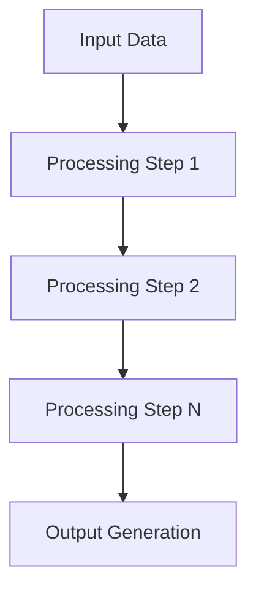

Project Specification: Asabaal Ventures Project Generator
1. Objective

Create a CLI tool named create-project that automates the creation of new Python projects. This tool enforces Asabaal Ventures' safety and architecture standards by automatically injecting (via symlinks and templates) the required protocols into every new project directory.
2. Core Strategy (The "Hybrid" Model)

To ensure all projects use the latest safety standards without version drift, the system will use a Global Source of Truth:

    Global Safety Protocols: Linked into projects via Symbolic Link (Symlink).

    Global Architecture: Linked into projects via Symbolic Link (Symlink).

    Local Architecture: Copied as a Template (Editable per project).

3. Global File System Setup

Before the CLI tool works, the following directory structure must exist in the user's home directory (~).
A. Directory Layout
Bash

~/.ai_safety/
    └── AI_SAFETY_DEVELOPMENT_PROTOCOLS.md  <-- The Authoritative Source

~/.architecture/
    └── GLOBAL_SYSTEM_ARCHITECTURE.md       <-- The Authoritative Source

B. Protocol Content Updates

The AI_SAFETY_DEVELOPMENT_PROTOCOLS.md must be updated to include the Code Failure & Responsibility Boundary Protocol discussed in the chat.

Content to append to AI Safety Protocols:

    4. Code Failure & Responsibility Boundary Protocol

        Purpose: To prevent emotional overload and loss of agency when code behaves unpredictably.

        Definitions:

            Code Failure Event (CFE): Any unexpected malfunction that blocks progress.

            Authorship Zone: The layer of work the user holds creative responsibility for. Generated code is outside this zone.

        Protocol Steps:

            Boundary Declaration: State "This code failure is outside my authorship zone."

            Cognitive Reset: Acknowledge you are not responsible for the break, only for the next action.

            Fallback Action: Choose one: Pause (step away), Escalate (hand to agent), or Revert (return to last stable state).

        Initialization: The agent must verify these protocols are loaded before technical work begins.

4. The CLI Tool Specification (create-project)
Location & Installation

    Source Script: ~/tools/project_generator/create_project.py

    Execution: Symlinked to $PATH (e.g., ~/.local/bin/create-project) so it can be run from any terminal location.

Functional Requirements

When the command create-project <project_name> is run, the script must:

    Check Pre-conditions: Verify global safety and architecture files exist in ~/.ai_safety and ~/.architecture. Fail if missing.

    Create Root Directory: Create a folder named <project_name>.

    Create Symlinks:

        Create a folder ai_safety/ inside the project that symlinks to ~/.ai_safety.

        Create a symlink architecture/GLOBAL_SYSTEM_ARCHITECTURE.md pointing to ~/.architecture/GLOBAL_SYSTEM_ARCHITECTURE.md.

    Generate Templates:

        Create architecture/LOCAL_SYSTEM_ARCHITECTURE.md by copying a standard template string (see Reference Implementation).

    Scaffold Standard Folders:

        src/ (with __init__.py)

        tests/ (with __init__.py)

        docs/

    Generate Meta Files:

        README.md (Stubbed with project name).

        .gitignore (Standard Python ignores).

5. Target Output Structure

After running create-project my_new_app, the resulting directory structure must look like this:
Plaintext

my_new_app/
├── .gitignore
├── README.md
├── ai_safety/                          <-- SYMLINK to ~/.ai_safety/
│   └── AI_SAFETY_DEVELOPMENT_PROTOCOLS.md (Read-only view of global)
├── architecture/
│   ├── GLOBAL_SYSTEM_ARCHITECTURE.md   <-- SYMLINK to ~/.architecture/...
│   └── LOCAL_SYSTEM_ARCHITECTURE.md    <-- COPIED Template (Editable)
├── docs/
├── src/
│   └── __init__.py
└── tests/
    └── __init__.py

6. Reference Implementation (Python)

Use this logic as the base for the coding agent.
Python

#!/usr/bin/env python3
import os
import sys
from pathlib import Path

# Get the directory where this script is located
SCRIPT_DIR = Path(__file__).parent.parent
GLOBAL_SAFETY_DIR = f"{SCRIPT_DIR}/.ai_safety"
GLOBAL_ARCH_DIR = f"{SCRIPT_DIR}/.architecture"

LOCAL_ARCH_TEMPLATE = """# Local System Architecture

**Document Version:** 1.0  
**Date:** {date}  
**Project:** {project_name}  
**Purpose:** Project-specific architecture extension of global principles  
**Compliance:** Following AI Safety Development Protocols (AI_SAFETY_DEVELOPMENT_PROTOCOLS.md)  
**Global Reference:** Global System Architecture (architecture/GLOBAL_SYSTEM_ARCHITECTURE.md)

---

## Project-Specific Architecture Extension

This document extends the global architecture principles for **{project_name}**. All project-specific implementations must comply with universal design principles, validation frameworks, and safety protocols defined in the global architecture.

---

## Project Overview

### **Purpose**
{project_purpose_placeholder}

### **Scope**
{project_scope_placeholder}

### **Requirements**
{project_requirements_placeholder}

### **Success Criteria**
{success_criteria_placeholder}

---

## Local Components

### Project-Specific Modules

#### **Component 1: [Component Name]**
- **Purpose**: [Component purpose and responsibility]
- **Integration**: [How it integrates with other components]
- **Interface**: [Public interface and contracts]
- **Dependencies**: [Required dependencies and their versions]

#### **Component 2: [Component Name]**
- **Purpose**: [Component purpose and responsibility]
- **Integration**: [How it integrates with other components]
- **Interface**: [Public interface and contracts]
- **Dependencies**: [Required dependencies and their versions]

#### **Component N: [Component Name]**
- **Purpose**: [Component purpose and responsibility]
- **Integration**: [How it integrates with other components]
- **Interface**: [Public interface and contracts]
- **Dependencies**: [Required dependencies and their versions]

---

## Data Flow

### Project-Specific Data Architecture

#### **Input Formats and Validation**
- **Primary Input Format**: [Describe input format]
- **Validation Schema**: [Describe validation requirements]
- **Error Handling**: [Describe error handling strategy]
- **Security Considerations**: [Describe input security measures]

#### **Processing Pipeline**

#### **Output Specifications**
- **Primary Output Format**: [Describe output format]
- **Metadata Requirements**: [Describe metadata requirements]
- **File Organization**: [Describe file organization structure]
- **Quality Standards**: [Describe output quality requirements]

#### **Integration with Global Standards**
- **Global Pattern Compliance**: [How this project follows global patterns]
- **Universal Interface Implementation**: [How universal interfaces are implemented]
- **Validation Framework Integration**: [How validation framework is used]
- **Safety Protocol Adherence**: [How safety protocols are followed]

---

## Safety and Boundaries

### Project-Specific Safety Constraints

#### **Interpretation of Global Safety Protocols**
- **AI Safety Protocol Application**: [How AI safety protocols apply to this project]
- **Human-in-the-Loop Implementation**: [How human oversight is implemented]
- **Scope Creep Prevention**: [How scope creep is prevented in this project]
- **Real Data Requirements**: [How real data-only development is enforced]

#### **Project-Specific Risk Assessments**
- **Technical Risks**: [List technical risks and mitigation strategies]
- **Process Risks**: [List process risks and mitigation strategies]
- **Security Risks**: [List security risks and mitigation strategies]
- **Collaboration Risks**: [List collaboration risks and mitigation strategies]

#### **Local Validation Requirements**
- **Component-Level Validation**: [How individual components are validated]
- **Integration Validation**: [How component integration is validated]
- **End-to-End Validation**: [How complete workflows are validated]
- **Performance Validation**: [How performance requirements are validated]

#### **Integration Testing Boundaries**
- **Unit Testing Boundaries**: [Scope of unit testing]
- **Integration Testing Boundaries**: [Scope of integration testing]
- **System Testing Boundaries**: [Scope of system testing]
- **User Acceptance Testing Boundaries**: [Scope of user acceptance testing]

---

## Compliance Framework

### Global Standards Integration

#### **Safety Protocol Adherence Methods**
- **Protocol Implementation**: [How safety protocols are implemented]
- **Compliance Verification**: [How compliance is verified]
- **Violation Detection**: [How protocol violations are detected]
- **Correction Procedures**: [How violations are corrected]

#### **Architecture Principle Implementation**
- **SOLID Principles**: [How SOLID principles are applied]
- **Layer-Based Architecture**: [How layering is implemented]
- **Separation of Concerns**: [How concerns are separated]
- **Interface Design**: [How interfaces are designed and implemented]

#### **Validation and Testing Approaches**
- **Universal Validation Pattern**: [How universal validation patterns are used]
- **Milestone-Based Testing**: [How milestone-based testing is implemented]
- **Real Data Testing**: [How real data testing is conducted]
- **Automated Testing**: [How automated testing is implemented]

#### **Documentation and Reporting Standards**
- **Code Documentation**: [How code is documented]
- **Architecture Documentation**: [How architecture is documented]
- **Test Documentation**: [How tests are documented]
- **Progress Reporting**: [How progress is reported]

---

## Project-Specific Implementation Details

### Technology Stack
- **Primary Language/Framework**: [Main technology choices]
- **Supporting Technologies**: [Supporting technologies and tools]
- **Development Environment**: [Development environment setup]
- **Deployment Environment**: [Deployment environment requirements]

### Development Workflow
- **Development Methodology**: [Development approach and methodology]
- **Code Review Process**: [How code reviews are conducted]
- **Testing Strategy**: [Overall testing strategy]
- **Release Process**: [How releases are managed]

### Maintenance and Evolution
- **Maintenance Strategy**: [How the project will be maintained]
- **Evolution Planning**: [How the project will evolve over time]
- **Update Procedures**: [How updates and changes are managed]
- **Decommissioning Planning**: [How end-of-life will be handled]

---

## Architecture Compliance Checklist

### Design Principle Compliance
- [ ] **Single Responsibility**: Each module has one clear purpose
- [ ] **Open/Closed**: Modules open for extension, closed for modification
- [ ] **Liskov Substitution**: Components can be substituted safely
- [ ] **Interface Segregation**: Minimal, focused interfaces
- [ ] **Dependency Inversion**: High-level modules independent of low-level details

### Structural Compliance
- [ ] **No Circular Dependencies**: Clean dependency graph
- [ ] **Loose Coupling**: Components communicate through interfaces
- [ ] **Strong Cohesion**: Related functionality grouped together
- [ ] **Layer Integrity**: Clear architectural layer separation
- [ ] **Abstraction Boundaries**: Implementation details properly encapsulated

### Safety Protocol Compliance
- [ ] **AI Safety Protocols**: All AI safety protocols followed
- [ ] **Human-in-the-Loop**: Human oversight implemented where required
- [ ] **Scope Creep Prevention**: Scope boundaries maintained
- [ ] **Real Data Development**: Only real data used for development and testing

### Quality Assurance Compliance
- [ ] **Testing Strategy**: Comprehensive test coverage implemented
- [ ] **Validation Framework**: Universal validation patterns used
- [ ] **Performance Monitoring**: Performance requirements met
- [ ] **Documentation**: Complete and up-to-date documentation

---

## Integration with Global Architecture

### Global Pattern Implementation
This project implements the following global patterns:

1. **Universal Component Architecture**: All components follow universal component patterns
2. **Data Flow Architecture**: Data flow follows universal pipeline patterns
3. **Validation Architecture**: Validation follows universal 4-phase pattern
4. **Human-AI Collaboration**: Collaboration follows universal protocols

### Global Standards Compliance
- **Design Principles**: All universal design principles are followed
- **Safety Protocols**: All safety protocols are implemented
- **Validation Standards**: All validation standards are met
- **Documentation Standards**: All documentation standards are followed

### Global Integration Points
- **Template System**: Uses universal template system patterns
- **Input/Output Interfaces**: Implements universal interface standards
- **Error Handling**: Follows universal error handling patterns
- **Security Standards**: Implements universal security requirements

---

## Version History

**v1.0 ({date}):** Initial local architecture document for {project_name}, extending global architecture principles with project-specific implementations and compliance frameworks.

---

**This document serves as the project-specific extension of global architecture principles and must be maintained in sync with the global architecture document to ensure consistency and compliance across all projects.**
"""

def ensure_global_files():
    required = [
        f"{GLOBAL_SAFETY_DIR}/AI_SAFETY_DEVELOPMENT_PROTOCOLS.md",
        f"{GLOBAL_ARCH_DIR}/GLOBAL_SYSTEM_ARCHITECTURE.md",
    ]
    for path in required:
        if not os.path.exists(path):
            print(f"[ERROR] Missing required global file: {path}")
            sys.exit(1)

def create_symlink(target, link_path):
    if os.path.exists(link_path): return
    os.symlink(target, link_path)

def create_project(project_name):
    project_path = Path(project_name)
    if project_path.exists():
        print(f"[ERROR] Directory '{project_name}' already exists.")
        sys.exit(1)

    print(f"[INFO] Creating project at {project_path}")
    project_path.mkdir(parents=True)

    # 1. Symlink Global Safety Directory
    create_symlink(GLOBAL_SAFETY_DIR, project_path / "ai_safety")

    # 2. Architecture Setup
    arch_dir = project_path / "architecture"
    arch_dir.mkdir()
    # Symlink Global Architecture File
    create_symlink(f"{GLOBAL_ARCH_DIR}/GLOBAL_SYSTEM_ARCHITECTURE.md", 
                   arch_dir / "GLOBAL_SYSTEM_ARCHITECTURE.md")
    # Write Local Architecture Template with project-specific content
    from datetime import datetime
    current_date = datetime.now().strftime("%B %d, %Y")
    local_arch_content = LOCAL_ARCH_TEMPLATE.format(
        date=current_date,
        project_name=project_name,
        project_purpose_placeholder="[Describe the specific purpose and goals of this project]",
        project_scope_placeholder="[Define the boundaries and limitations of this project]",
        project_requirements_placeholder="[List specific technical and functional requirements]",
        success_criteria_placeholder="[Define measurable success criteria for this project]"
    )
    with open(arch_dir / "LOCAL_SYSTEM_ARCHITECTURE.md", "w") as f:
        f.write(local_arch_content)

    # 3. Standard Directories
    for folder in ["src", "tests", "docs"]:
        (project_path / folder).mkdir()
        if folder in ["src", "tests"]:
            open(project_path / folder / "__init__.py", "w").close()

    # 4. Meta Files
    with open(project_path / ".gitignore", "w") as f:
        f.write("__pycache__/\n.env\n.DS_Store\n*.pyc\n")
    with open(project_path / "README.md", "w") as f:
        f.write(f"# {project_name}\n\nGenerated via create-project CLI with global architecture standards.\n\n## Architecture\n\nThis project follows global architecture principles defined in:\n- `ai_safety/AI_SAFETY_DEVELOPMENT_PROTOCOLS.md`\n- `architecture/GLOBAL_SYSTEM_ARCHITECTURE.md`\n- `architecture/LOCAL_SYSTEM_ARCHITECTURE.md`\n\n## Getting Started\n\n1. Review the architecture documents\n2. Update the local architecture with project-specific details\n3. Follow the safety protocols for all development\n\n## Compliance\n\nThis project complies with:\n- AI Safety Development Protocols\n- Global System Architecture Principles\n- Universal Validation Framework\n- Human-AI Collaboration Protocols\n")

    print(f"[SUCCESS] Project '{project_name}' scaffolded with global architecture standards.")

if __name__ == "__main__":
    if len(sys.argv) != 2:
        print("Usage: create-project <project_name>")
        sys.exit(1)
    ensure_global_files()
    create_project(sys.argv[1])